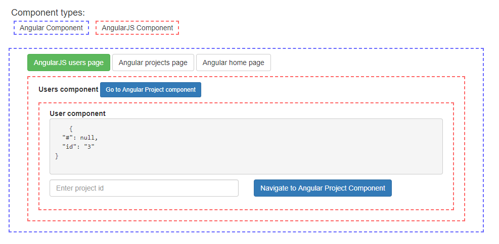

## Angular + AngularJS Routing implementation

### Router packages:

* angular - `@angular/router@^5.0.2`
* angularjs - `@uirouter/angularjs@^1.0.11`

### Redirection methods:

* angular -> angularJS  using `routerLink` / `router.navigate()`
* angularJS -> angular  using `state.go()`

### Sync routers:

* in `RouterModule.forRoot` with `ExtraOptions` we need to disable initial navigation with `{ initialNavigation: false }`. Example `~/src/app.module.ts:44`
* in `bootstrapModule` hybrid phase
    * activate navigation again with `platformRef.injector.get(Router).initialNavigation()`. Example: `~/src/main.ts:22`
    * sync History Api with both routing system with `setUpLocationSync`. Example: `~/src/main.ts:23`

### Setup:
* `yarn init` / `npm i`
* `yarn start` / `npm start`
* Open application in browser: `http://localhost:3000`
